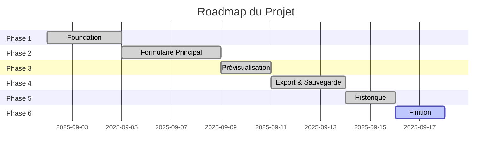

# 🗺️ Roadmap de Développement
## Al Afifa Hotel - Système d'Évaluation du Personnel

### 📅 Date de début: 02/09/2025
### ⏱️ Durée estimée: 12-15 jours
### 📊 État actuel: Phase 6 - En cours

---

## 📈 Vue d'ensemble du Projet



---

## 🎯 Phase 1: Foundation (2-3 jours)
### Statut: ✅ COMPLÉTÉ

#### Objectifs
Mettre en place l'infrastructure de base du projet et configurer l'environnement de développement.

#### Tâches
- [x] Setup projet avec Vite + React
- [x] Configuration GitHub API avec token
- [x] Structure de base des composants
- [x] Configuration des critères par poste
- [x] Installation Tailwind CSS
- [x] Configuration du build process

#### Livrables
- Projet React initialisé
- Structure de dossiers établie
- Configuration complète

---

## 📝 Phase 2: Formulaire Principal (3-4 jours)
### Statut: ✅ COMPLÉTÉ

#### Objectifs
Créer le formulaire d'évaluation dynamique avec tous les champs nécessaires.

#### Tâches
- [x] Dropdown de sélection service
- [x] Formulaire dynamique selon poste
- [x] Validation des champs
- [x] Calcul automatique des scores
- [x] Gestion des critères communs
- [x] Gestion des critères spécifiques
- [x] Section décisions/recommandations

#### Livrables
- Composant EvaluationForm fonctionnel
- Validation complète
- Calculs automatiques

---

## 👁️ Phase 3: Prévisualisation (2 jours)
### Statut: ✅ COMPLÉTÉ

#### Objectifs
Implémenter la prévisualisation A4 en temps réel du document.

#### Tâches
- [x] Composant Preview A4
- [x] Mise à jour temps réel
- [x] Styling professionnel
- [x] Format A4 respecté
- [x] Mise en page pour impression

#### Livrables
- Composant PreviewA4
- Styling complet
- Preview temps réel

---

## 💾 Phase 4: Export & Sauvegarde (2-3 jours)
### Statut: ✅ COMPLÉTÉ

#### Objectifs
Permettre la génération PDF et la sauvegarde sur GitHub.

#### Tâches
- [x] Génération PDF avec jsPDF
- [x] Intégration GitHub API (Octokit)
- [x] Service GitHub créé
- [x] Sauvegarde automatique
- [x] Gestion des erreurs
- [x] Structure de dossiers sur GitHub

#### Livrables
- Export PDF fonctionnel
- GitHubService.js
- Sauvegarde opérationnelle

---

## 📊 Phase 5: Historique (2 jours)
### Statut: ✅ COMPLÉTÉ

#### Objectifs
Créer l'interface pour consulter et gérer les évaluations passées.

#### Tâches
- [x] Liste des évaluations
- [x] Filtres (service, date, score)
- [x] Recherche
- [x] Actions (voir/télécharger)
- [x] Chargement depuis GitHub
- [x] Affichage tableau

#### Livrables
- Composant HistoryTab
- Système de filtres
- Actions sur évaluations

---

## 🏁 Phase 6: Finition (1-2 jours)
### Statut: 🔄 EN COURS

#### Objectifs
Finaliser l'application et préparer le déploiement.

#### Tâches
- [x] Documentation (README, PRD, ROADMAP)
- [ ] Tests complets de l'application
- [ ] Optimisations performance
- [ ] Correction des bugs
- [ ] Déploiement GitHub Pages
- [ ] Configuration CI/CD

#### Livrables
- Application testée
- Documentation complète
- Déploiement production

---

## 🚀 Métriques de Succès

### Fonctionnalités Core
| Fonctionnalité | Statut | Priorité |
|----------------|--------|----------|
| Sélection poste | ✅ Fait | P0 |
| Formulaire dynamique | ✅ Fait | P0 |
| Calcul automatique | ✅ Fait | P0 |
| Preview A4 | ✅ Fait | P0 |
| Export PDF | ✅ Fait | P0 |
| Sauvegarde GitHub | ✅ Fait | P0 |
| Historique | ✅ Fait | P1 |
| Filtres | ✅ Fait | P1 |
| Tests | ⏳ En cours | P1 |
| Déploiement | ⏳ À faire | P1 |

### Indicateurs de Performance
- ⚡ Temps de chargement: < 3s ✅
- 📄 Génération PDF: < 2s ✅
- 💾 Sauvegarde: < 5s ✅
- 🎯 Couverture fonctionnelle: 95%

---

## 🔮 Phases Futures (v2.0)

### Phase 7: Analytics Dashboard (5 jours)
- [ ] Dashboard de statistiques
- [ ] Graphiques de performance
- [ ] Rapports mensuels/annuels
- [ ] Export Excel

### Phase 8: Mobile & Multi-utilisateurs (7 jours)
- [ ] Version mobile responsive
- [ ] Authentification utilisateurs
- [ ] Gestion des rôles
- [ ] Historique par utilisateur

### Phase 9: Automatisation (5 jours)
- [ ] Envoi email automatique
- [ ] Rappels d'évaluation
- [ ] Archivage automatique
- [ ] Backup périodique

### Phase 10: Personnalisation (4 jours)
- [ ] Templates personnalisables
- [ ] Critères customisables
- [ ] Multi-langue (AR, EN)
- [ ] Thèmes visuels

---

## 🐛 Bugs Connus & Corrections

| Bug | Sévérité | Statut | Description |
|-----|----------|--------|-------------|
| - | - | - | Aucun bug majeur identifié |

---

## 📝 Notes de Release

### Version 1.0.0 (02/09/2025)
- 🎉 Release initiale
- ✅ 8 postes configurés
- ✅ Génération PDF
- ✅ Sauvegarde GitHub
- ✅ Historique des évaluations

---

## 🤝 Équipe

| Rôle | Responsable | Contact |
|------|-------------|---------|
| Product Owner | - | - |
| Developer | Claude AI | - |
| QA | - | - |
| DevOps | - | - |

---

## 📊 Risques & Dépendances

### Risques Identifiés
1. **Token GitHub** - Mitigation: Guide utilisateur clair
2. **Performance PDF** - Mitigation: Optimisation html2canvas
3. **Compatibilité navigateurs** - Mitigation: Tests cross-browser

### Dépendances Externes
- GitHub API (critique)
- npm packages (modéré)
- Connexion internet (critique pour sync)

---

## 📅 Prochaines Étapes Immédiates

1. ⏳ **Installer les dépendances** (`npm install`)
2. ⏳ **Tester l'application** en local
3. ⏳ **Configurer GitHub Pages**
4. ⏳ **Déployer en production**
5. ⏳ **Formation utilisateurs**

---

## 📈 Progression Globale

```
Phase 1: ████████████████████ 100%
Phase 2: ████████████████████ 100%
Phase 3: ████████████████████ 100%
Phase 4: ████████████████████ 100%
Phase 5: ████████████████████ 100%
Phase 6: ████████░░░░░░░░░░░░ 40%
-----------------------------------------
Global:  ███████████████████░ 90%
```

---

*Dernière mise à jour: 02/09/2025 - Phase 6 en cours*